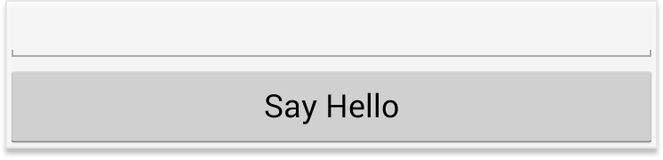

[](https://confluence.jetbrains.com/display/ALL/JetBrains+on+GitHub)
[ ](https://bintray.com/jetbrains/anko/anko/_latestVersion)
[](https://teamcity.jetbrains.com/viewType.html?buildTypeId=ProjectsWrittenInKotlin_Anko&tab=buildTypeStatusDiv)
[](http://www.apache.org/licenses/LICENSE-2.0)


Anko is a [Kotlin](http://www.kotlinlang.org/) library which makes Android application development faster and easier. It makes your code clean and easy to read, and lets you forget about rough edges of the Android SDK for Java.

Anko consists of several parts:

* *Anko Commons*: a lightweight library full of helpers for intents, dialogs, logging and so on;
* *Anko Layouts*: a fast and type-safe way to write dynamic Android layouts;
* *Anko SQLite*: a query DSL and parser collection for Android SQLite;
* *Anko Coroutines*: utilities based on the [kotlinx.coroutines](https://github.com/Kotlin/kotlinx.coroutines) library.

## Anko Commons

*Anko Commons* is a "toolbox" for Kotlin Android developer. The library contains a lot of helpers for Android SDK, including, but not limited to:

* Intents ([wiki](https://github.com/Kotlin/anko/wiki/Anko-Commons-–-Intents));
* Dialogs and toasts ([wiki](https://github.com/Kotlin/anko/wiki/Anko-Commons-–-Dialogs));
* Logging ([wiki](https://github.com/Kotlin/anko/wiki/Anko-Commons-–-Logging));
* Resources and dimensions ([wiki](https://github.com/Kotlin/anko/wiki/Anko-Commons-–-Misc)).

## Anko Layouts ([wiki](https://github.com/Kotlin/anko/wiki/Anko-Layouts))

*Anko Layouts* is a DSL for writing dynamic Android layouts. Here is a simple UI written with Anko DSL:

```kotlin
verticalLayout {
    val name = editText()
    button("Say Hello") {
        onClick { toast("Hello, ${name.text}!") }
    }
}
```

The code above creates a button inside a `LinearLayout` and attaches an `OnClickListener` to that button. Moreover, `onClick` accepts a [`suspend` lambda](http://kotlinlang.org/docs/reference/coroutines.html), so you can write your asynchronous code right inside the listener!

Note that this is the complete layout code. No XML is required!

Anko has a [DSL for ConstraintLayout](https://github.com/Kotlin/anko/wiki/ConstraintLayout) since v0.10.4



There is also a [plugin](https://github.com/Kotlin/anko/wiki/Anko-Layouts#anko-support-plugin) for Android Studio that supports previewing Anko DSL layouts.

## Anko SQLite ([wiki](https://github.com/Kotlin/anko/wiki/Anko-SQLite))

Have you ever been tired of parsing SQLite query results using Android cursors? *Anko SQLite* provides lots of helpers to simplify working with SQLite databases.

For example, here is how you can fetch the list of users with a particular name:

```kotlin
fun getUsers(db: ManagedSQLiteOpenHelper): List<User> = db.use {
    db.select("Users")
            .whereSimple("family_name = ?", "John")
            .doExec()
            .parseList(UserParser)
}
```

## Anko Coroutines ([wiki](https://github.com/Kotlin/anko/wiki/Anko-Coroutines))

*Anko Coroutines* is based on the [`kotlinx.coroutines`](https://github.com/kotlin/kotlinx.coroutines) library and provides:

* [`bg()`](https://github.com/Kotlin/anko/wiki/Anko-Coroutines#bg) function that executes your code in a common pool.
* [`asReference()`](https://github.com/Kotlin/anko/wiki/Anko-Coroutines#asreference) function which creates a weak reference wrapper. By default, a coroutine holds references to captured objects until it is finished or canceled. If your asynchronous framework does not support cancellation, the values you use inside the asynchonous block can be leaked. `asReference()` protects you from this.

## Using Anko

### Gradle-based project

Anko has a meta-dependency which plugs in all available features (including Commons, Layouts, SQLite) into your project at once:

```gradle
dependencies {
    implementation "org.jetbrains.anko:anko:$anko_version"
}
```
Make sure that you have the ```$anko_version``` settled in your gradle file at the project level:

```
ext.anko_version='0.10.5'
```

If you only need some of the features, you can reference any of Anko's parts:

```gradle
dependencies {
    // Anko Commons
    implementation "org.jetbrains.anko:anko-commons:$anko_version"

    // Anko Layouts
    implementation "org.jetbrains.anko:anko-sdk25:$anko_version" // sdk15, sdk19, sdk21, sdk23 are also available
    implementation "org.jetbrains.anko:anko-appcompat-v7:$anko_version"

    // Coroutine listeners for Anko Layouts
    implementation "org.jetbrains.anko:anko-sdk25-coroutines:$anko_version"
    implementation "org.jetbrains.anko:anko-appcompat-v7-coroutines:$anko_version"

    // Anko SQLite
    implementation "org.jetbrains.anko:anko-sqlite:$anko_version"
}
```

There are also a number of artifacts for the Android support libraries:

```gradle
dependencies {
    // Appcompat-v7 (only Anko Commons)
    implementation "org.jetbrains.anko:anko-appcompat-v7-commons:$anko_version"

    // Appcompat-v7 (Anko Layouts)
    implementation "org.jetbrains.anko:anko-appcompat-v7:$anko_version"
    implementation "org.jetbrains.anko:anko-coroutines:$anko_version"

    // CardView-v7
    implementation "org.jetbrains.anko:anko-cardview-v7:$anko_version"

    // Design
    implementation "org.jetbrains.anko:anko-design:$anko_version"
    implementation "org.jetbrains.anko:anko-design-coroutines:$anko_version"

    // GridLayout-v7
    implementation "org.jetbrains.anko:anko-gridlayout-v7:$anko_version"

    // Percent
    implementation "org.jetbrains.anko:anko-percent:$anko_version"

    // RecyclerView-v7
    implementation "org.jetbrains.anko:anko-recyclerview-v7:$anko_version"
    implementation "org.jetbrains.anko:anko-recyclerview-v7-coroutines:$anko_version"

    // Support-v4 (only Anko Commons)
    implementation "org.jetbrains.anko:anko-support-v4-commons:$anko_version"

    // Support-v4 (Anko Layouts)
    implementation "org.jetbrains.anko:anko-support-v4:$anko_version"

    // ConstraintLayout
    implementation "org.jetbrains.anko:anko-constraint-layout:$anko_version"
}
```

There is an [example project](https://github.com/kotlin/anko-example) showing how to include Anko library into your Android Gradle project.

### IntelliJ IDEA project

If your project is not based on Gradle, just attach the required JARs from the [jcenter repository](https://jcenter.bintray.com/org/jetbrains/anko/) as the library dependencies and that's it.

## Contributing

The best way to submit a patch is to send us a [pull request](https://help.github.com/articles/about-pull-requests/). Before submitting the pull request, make sure all existing tests are passing, and add the new test if it is required.

If you want to add new functionality, please file a new *proposal* issue first to make sure that it is not in progress already. If you have any questions, feel free to create a *question* issue.

Instructions for building Anko are available in the [Wiki](https://github.com/Kotlin/anko/wiki/Building-Anko).
