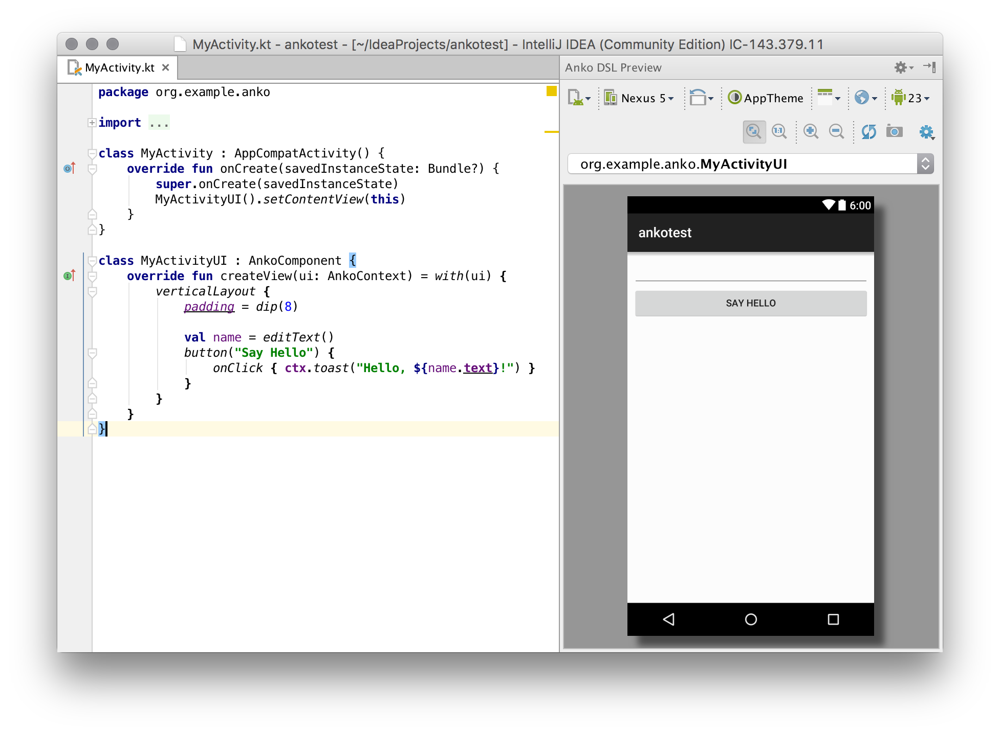

Anko Preview Plugin
===================

Anko Preview plugin is available for IntelliJ IDEA and Android Studio. It allows you to preview `AnkoComponent` classes written with Anko directly in the IDE tool window.

## Using Anko Preview Plugin

### Installing the Plugin

You can download Anko Preview plugin [here](https://plugins.jetbrains.com/update/index?pr=&updateId=19242).

### Preview

Suppose you have this class written with Anko:

```kotlin
class MyActivity : AppCompatActivity() {
    override fun onCreate(savedInstanceState: Bundle?, persistentState: PersistableBundle?) {
        super.onCreate(savedInstanceState, persistentState)
        MyActivityUI().setContentView(this)
    }
}

class MyActivityUI : AnkoComponent {
    override fun createView(ui: AnkoContext): View = with(ui) {
        verticalLayout {
            val name = editText()
            button("Say Hello") {
                onClick { ctx.toast("Hello, ${name.text}!") }
            }
        }
    }
}
```

Put the cursor somewhere inside the `MyActivityUI` declaration, open the *Anko DSL Preview* tool window ("View" → "Tool Windows" → "DSL Preview") and press *Refresh*.



Module make is required, so it could take some time before the image will be actually shown.

## XML to DSL Converter

Plugin also supports converting layouts from the XML format to Anko DSL code. Open an XML file and select "Code" → "Convert to Anko DSL". You can convert several XML layout files simultaneously.
